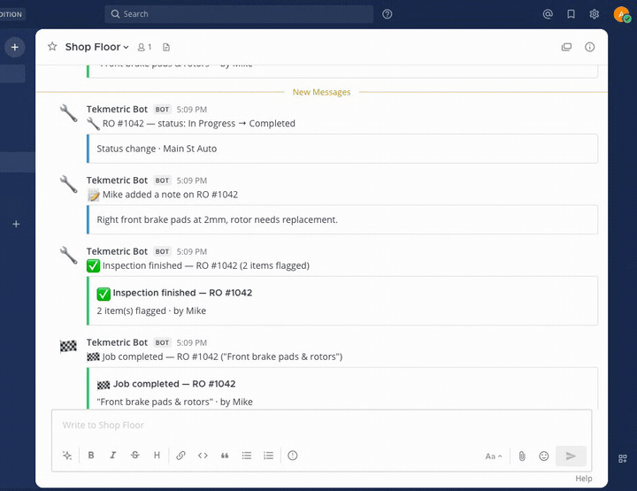
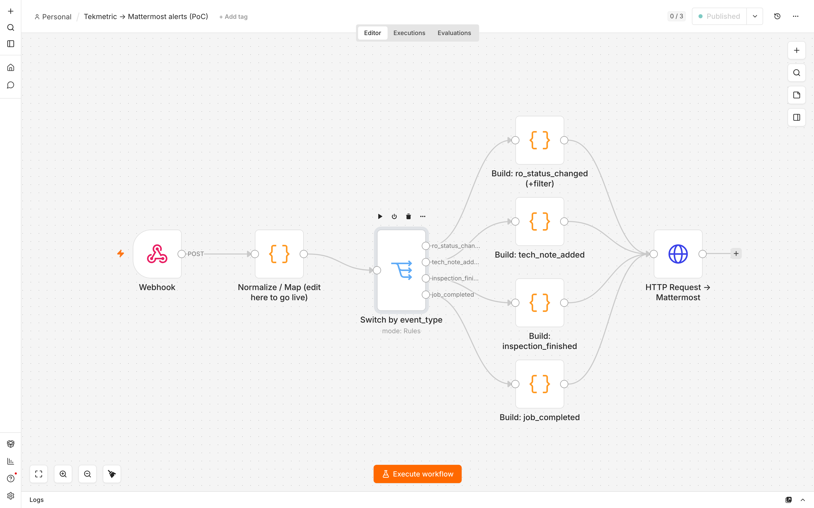
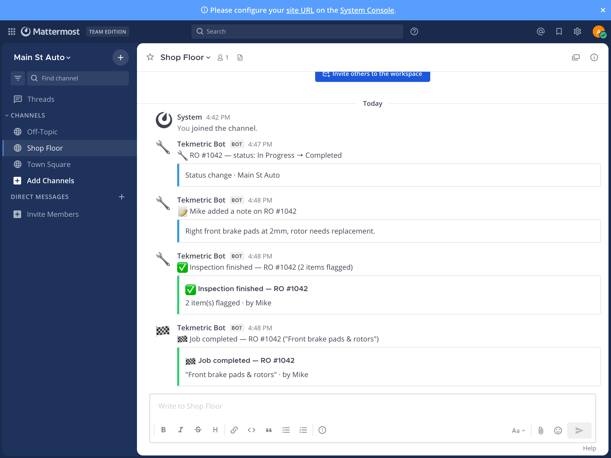

# Tekmetric → n8n → Mattermost alerts (PoC)

Receives shop-floor events from [Tekmetric](https://tekmetric.com/) and posts
formatted, emoji-tagged alerts into a [Mattermost](https://mattermost.com/)
channel — so the whole shop sees what's happening without opening Tekmetric.
Everything runs **locally** (n8n + Mattermost in Docker); no external SaaS, no
paid APIs.

**See it in action** — firing the 4 sample events (`./fire.sh`) and watching
them land in the `#shop-floor` channel in real time:



▶ Higher-quality video: [`docs/shop-floor-demo.mp4`](docs/shop-floor-demo.mp4)
(264 KB — best for sharing directly with the shop owner).

```
[Webhook] → [Normalize/Map] → [Switch by event_type] → [Build message ×4] → [HTTP → Mattermost]
 trigger    the ONLY layer        4 branches (+filter)    emoji + colored          Incoming Webhook
            you touch to go live                          attachments
```

The actual n8n workflow:



---

## ⚠️ Honest disclaimer (read this first)

- This is a **Proof of Concept**, not a production integration.
- The webhook payloads in [`sample_payloads/`](sample_payloads/) are an
  **ASSUMED schema that we invented** — they are **not validated against the
  live Tekmetric webhook format**, which we don't have yet. The field names and
  structure are our best-guess, clearly marked as assumptions.
- **Going live is a one-place change.** Every Tekmetric-specific field name is
  isolated in a single node — *"Normalize / Map (edit here to go live)"* in the
  workflow. When we have the real Tekmetric webhook (Settings → Integrations →
  Webhooks), we remap field paths in that one node. Nothing else changes.

---

## What it does — the 4 events

The workflow branches on `event_type`. Importance is **deliberately not equal** —
the two events that should make a human pick up the phone get a loud colored
attachment; the routine ones stay quiet.

| `event_type`          | meaning                | importance | example message |
|-----------------------|------------------------|-----------|-----------------|
| `ro_status_changed`   | repair-order status    | medium 🔵 | 🔧 RO #1042 — status: In Progress → Completed |
| `tech_note_added`     | technician note        | medium 🔵 | 📝 Mike added a note on RO #1042 |
| `inspection_finished` | inspection done        | **high 🟢** | ✅ Inspection finished — RO #1042 (2 items flagged) |
| `job_completed`       | a job finished         | **high 🟢** | 🏁 Job completed — RO #1042 ("Front brake pads & rotors") |

- **High** (`inspection_finished`, `job_completed`) → green (`#2ecc71`) colored
  attachment, so it stands out. These directly trigger "call the customer next".
- **Medium** (`ro_status_changed`, `tech_note_added`) → quiet, blue (`#3498db`).
- **Noise filter:** `ro_status_changed` only notifies on **major** transitions
  (`to_status` ∈ `In Progress`, `Completed`). Trivial transitions are dropped.
  (See the comment block in the *Build: ro_status_changed (+filter)* node.)

---

## Setup

Prereqs: Docker (Desktop, or Colima on macOS) with Docker Compose.

```bash
# 1. Start n8n + Mattermost
docker compose up -d

# 2. Configure Mattermost (admin user, team, #shop-floor, incoming webhook).
#    Fully automated via the Mattermost REST API — no UI clicks.
#    Writes the webhook URL into ./.env for n8n to read.
./scripts/setup_mattermost.sh

# 3. Re-up so n8n picks up MATTERMOST_WEBHOOK_URL from .env
docker compose up -d

# 4. Import + activate the n8n workflow (no "Execute" clicking needed)
./scripts/setup_n8n.sh

# 5. Fire the demo!
./fire.sh
```

Then open Mattermost at **http://localhost:8065** (login `admin@example.com` /
`Admin12345!`), channel **#shop-floor**, and watch the alerts arrive.

> **No UI clicks are required for setup** — Mattermost is configured entirely
> through its REST API in `scripts/setup_mattermost.sh`. The only manual thing
> is *logging into the web UI to watch the demo*, which is the point of the demo.

### How the Mattermost URL stays in one place

The Incoming Webhook URL lives in exactly one spot: the `MATTERMOST_WEBHOOK_URL`
env var (written to `.env` by the setup script, fed to n8n by Compose). The
workflow's HTTP node references `{{ $env.MATTERMOST_WEBHOOK_URL }}` — it is never
hard-coded into nodes. To repoint, change `.env` and `docker compose up -d`.

---

## Firing events

```bash
./fire.sh                            # fire all 4 events, ~2s apart (demo / recording)
./fire.sh inspection_finished        # fire one event
./fire.sh ro_status_changed_trivial  # a trivial transition → should be FILTERED OUT
```

Each command POSTs `sample_payloads/<event>.json` to the n8n production webhook
at `http://localhost:5678/webhook/tekmetric`.

---

## Verification

The 4 alerts as they land in Mattermost (`#shop-floor`, from **Tekmetric Bot** —
note the green cards for the two high-priority events, blue for the routine ones):



Run live on 2026-06-21 (macOS / Apple Silicon, Colima + Docker). All checks
fired through the **active production webhook** and confirmed by reading the
Mattermost channel back via its REST API:

| check | result |
|-------|--------|
| `docker compose up` starts n8n + Mattermost | ✅ both up |
| Mattermost incoming webhook created, URL obtained | ✅ via REST API, no UI clicks |
| n8n workflow imported and **active** | ✅ `tekmetricmm0001`, active |
| `ro_status_changed` (major) → 🔧 message | ✅ `🔧 RO #1042 — status: In Progress → Completed` (blue) |
| `tech_note_added` → 📝 message | ✅ `📝 Mike added a note on RO #1042` (blue, note in attachment) |
| `inspection_finished` → ✅ green attachment | ✅ green `#2ecc71` card, `2 item(s) flagged · by Mike` |
| `job_completed` → 🏁 green attachment | ✅ green `#2ecc71` card, `"Front brake pads & rotors" · by Mike` |
| trivial `ro_status_changed` (`to_status` not major) → **not notified** | ✅ filtered out (channel showed **4** posts, not 5) |
| posts show as **Tekmetric Bot** with wrench / checkered-flag icons | ✅ username + icon override working |

> Reproduce: `docker compose up -d && ./scripts/setup_mattermost.sh && docker compose up -d && ./scripts/setup_n8n.sh && ./fire.sh`

---

## Design choices (and why)

- **No LLM / external AI on the hot path.** Every message is built by
  deterministic templates (the *Build* nodes). The client's pain is "it works,
  then it breaks" — adding a non-deterministic, slow, paid dependency to the
  notification path would make that worse, not better. Reliability > cleverness.
- **Importance tiering, not a firehose.** If everything pings equally, people
  tune it out. High-value events (inspection / job done) get a loud colored
  card; routine ones stay muted; trivial status flips are filtered entirely.
- **Purpose-built for these 4 events, not a generic JSON parser.** The workflow
  is shaped to this shop's 4 triggers on purpose — that's what makes the output
  clean and the behavior predictable.
- **Productionizing is one node.** All Tekmetric field-name coupling lives in the
  single *Normalize / Map* node, so going live is a contained, low-risk edit.
- **No over-engineering.** No auth, persistence, retries, or multi-tenancy — out
  of scope for a PoC whose job is to show a working, differentiated demo.

---

## Repo layout

```
.
├── README.md
├── docker-compose.yml                  # n8n + Mattermost, local only
├── workflow/
│   └── tekmetric-mattermost.json       # importable n8n workflow
├── sample_payloads/                    # ASSUMED Tekmetric payloads (4 + 1 trivial)
│   ├── ro_status_changed.json
│   ├── ro_status_changed_trivial.json  # for the filter test
│   ├── tech_note_added.json
│   ├── inspection_finished.json
│   └── job_completed.json
├── scripts/
│   ├── setup_mattermost.sh             # API-only Mattermost setup → writes .env
│   └── setup_n8n.sh                    # import + activate workflow
├── docs/                               # screenshots used in this README
└── fire.sh                             # fire events at n8n
```

---

## Going to production (3 steps)

1. **Get the real Tekmetric payload** from Settings → Integrations → Webhooks.
2. **Remap the one node** — update field paths in *Normalize / Map (edit here to
   go live)* to match Tekmetric's actual fields. Nothing downstream changes.
3. **Register the real webhook** — point Tekmetric at this workflow's URL (and
   move off the local stack to a hosted n8n + your real Mattermost).
